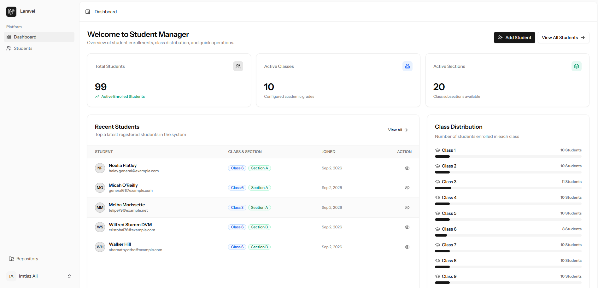
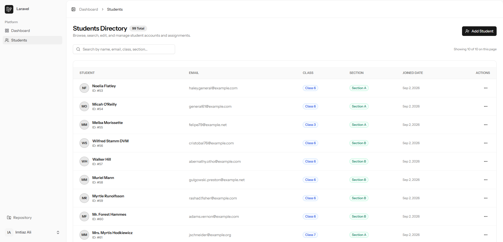
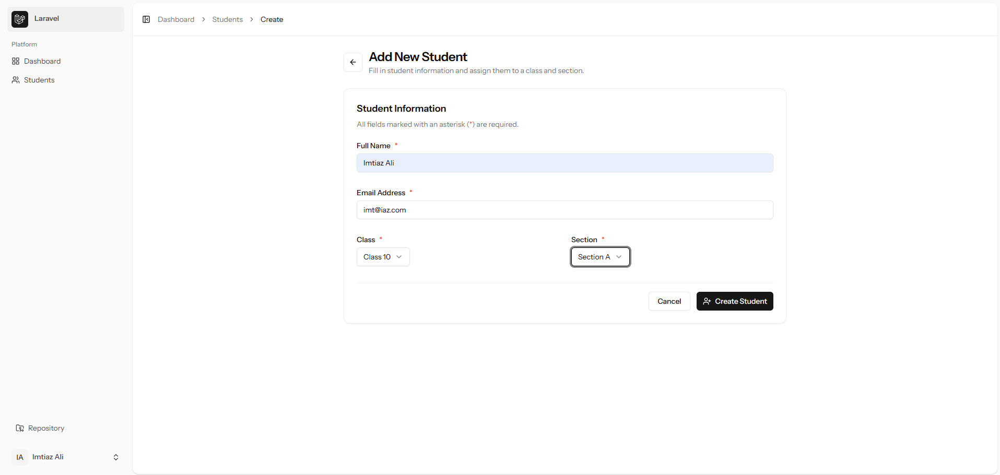
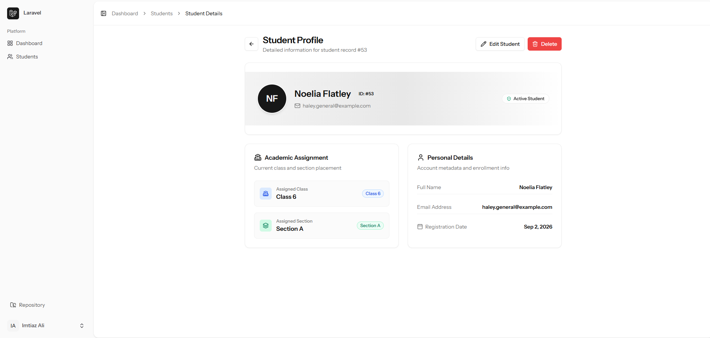
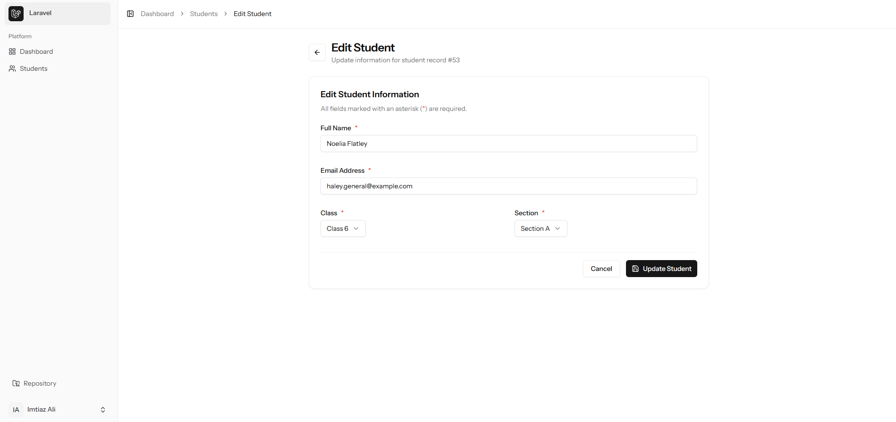
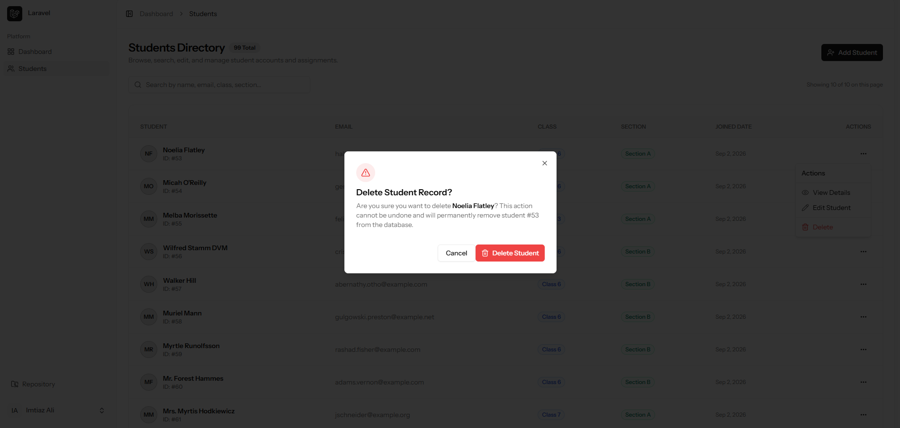
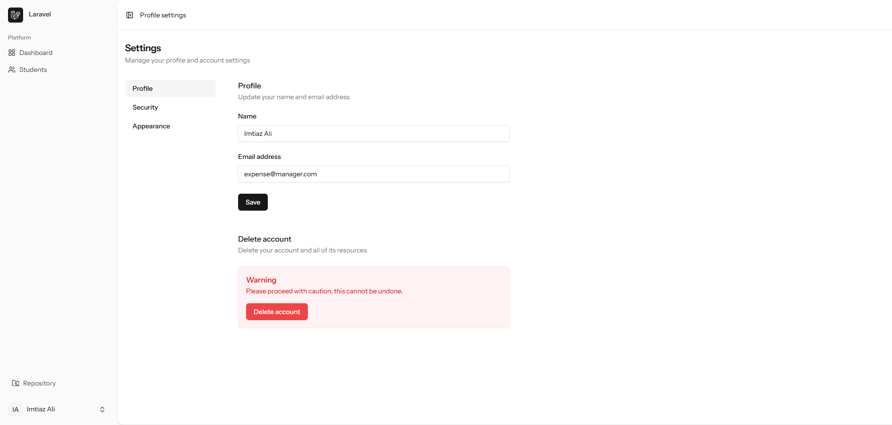

# 🎓 Student Manager Application

A modern, full-stack Academic Administration & Student Management application built with **Laravel 13**, **Inertia.js v3**, **Vue 3**, and **Tailwind CSS v4**.


---

## 📌 Overview

**Student Manager** provides educational institutions with a seamless, responsive, and real-time dashboard to handle student enrollments, manage class and section assignments, and perform full CRUD operations with interactive safety confirmation dialogs.

---

## ✨ Features

- ⚡ **Interactive Analytics Dashboard**: Real-time KPI metrics (Total Students, Active Classes, Active Sections), latest enrollments list, and class-wise student distribution progress bars.
- 🎓 **Student Directory Management**:
    - **LIFO Sorting**: Newly added students automatically appear at the top.
    - **Instant Search**: Real-time filtering by Student Name, Email, Class, or Section.
    - **Pagination**: Complete pagination controls with First, Previous, Page Numbers, Next, and Last buttons.
- ➕ **Dynamic Student Creation**: Dependent dropdown select for Classes and Sections — selecting a class automatically loads only its corresponding sections.
- 👁️ **Detailed Student Profile**: Dedicated view page with student metadata, academic assignment badges, and quick action shortcuts.
- ✏️ **Seamless Editing**: Pre-filled update form with real-time class/section binding and validation error feedback.
- 🗑️ **Safe Deletions**: Modal confirmation dialog preventing accidental student deletions.
- 🔐 **Authentication & Security**: Powered by Laravel Fortify with session management and user settings (Profile update, Password change, 2FA, Dark/Light appearance themes).

---

## 🖼️ Application Previews

### 1. Interactive Dashboard

Overview of total student metrics, quick shortcut buttons, recent enrollments, and class distribution analytics.


---

### 2. Students Directory

LIFO-ordered student directory with instant search, class/section badges, and pagination.


---

### 3. Add Student Form

Dynamic student registration form with dependent class and section selectors.


---

### 4. Student Details Profile Page

Comprehensive view of a student's profile, academic placement, and registration info.


---

### 5. Edit Student Information

Prefilled update form with dynamic class/section re-assignment.


---

### 6. Delete Confirmation Modal

Interactive confirmation dialog before removing a student record.


---

### 7. Account & Profile Settings

Built-in user profile, security settings, and appearance preference management.


---

## 🛠️ Tech Stack & Dependencies

### Backend

- **Framework**: Laravel 13.x
- **Authentication**: Laravel Fortify
- **API Transformations**: Eloquent API Resources (`StudentResource`, `ClassesResource`, `SectionResource`)
- **Route Functions**: Laravel Wayfinder (Auto-generated typed route helpers)

### Frontend

- **SPA Bridge**: Inertia.js v3
- **UI Framework**: Vue 3 (Composition API with `<script setup lang="ts">`)
- **Styling**: Tailwind CSS v4
- **Components & Icons**: Lucide Vue Icons & Reka UI / shadcn-vue primitives

---

## 🚀 Getting Started & Installation

Follow these steps to get a local copy up and running:

### Prerequisites

- **PHP** >= 8.3
- **Composer** >= 2.x
- **Node.js** >= 18.x & **npm**

### Step-by-Step Setup

1. **Clone the repository**:

    ```bash
    git clone https://github.com/Imtiaz-Ali17314/Student-Manager-Laravel-Inertia-Vue.git
    cd Student-Manager-Laravel-Inertia-Vue
    ```

2. **Install PHP Dependencies**:

    ```bash
    composer install
    ```

3. **Install JavaScript Dependencies**:

    ```bash
    npm install
    ```

4. **Configure Environment File**:

    ```bash
    cp .env.example .env
    php artisan key:generate
    ```

5. **Configure Database**:
   Update your `.env` file with your database credentials (SQLite, MySQL, or PostgreSQL):

    ```env
    DB_CONNECTION=sqlite
    # OR for MySQL:
    # DB_CONNECTION=mysql
    # DB_HOST=127.0.0.1
    # DB_PORT=3306
    # DB_DATABASE=student_manager
    # DB_USERNAME=root
    # DB_PASSWORD=
    ```

6. **Run Database Migrations & Seeders**:

    ```bash
    php artisan migrate --seed
    ```

7. **Build Assets & Start Development Servers**:
   Run both the Vite dev server and Laravel local server:

    ```bash
    # Terminal 1 (Vite):
    npm run dev

    # Terminal 2 (Laravel):
    php artisan serve
    ```

    Or use the unified dev command:

    ```bash
    composer run dev
    ```

8. **Access the Application**:
   Open your browser and navigate to `http://localhost:8000`.

---

## 🧪 Testing & Code Quality

Run tests and code quality checks using Pest and Laravel Pint:

```bash
# Run test suite
php artisan test

# Run code formatter
vendor/bin/pint

# Run TypeScript type check
npm run check
```

---

## 📁 Database Schema Summary

| Table      | Primary Key | Key Attributes                            | Relationships                              |
| ---------- | ----------- | ----------------------------------------- | ------------------------------------------ |
| `classes`  | `id`        | `name`                                    | `hasMany(Section)`, `hasMany(Student)`     |
| `sections` | `id`        | `name`, `class_id`                        | `belongsTo(Classes)`, `hasMany(Student)`   |
| `students` | `id`        | `name`, `email`, `class_id`, `section_id` | `belongsTo(Classes)`, `belongsTo(Section)` |

---

## 📄 License

This project is open-source software licensed under the [MIT license](LICENSE).
